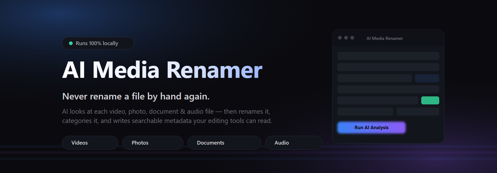
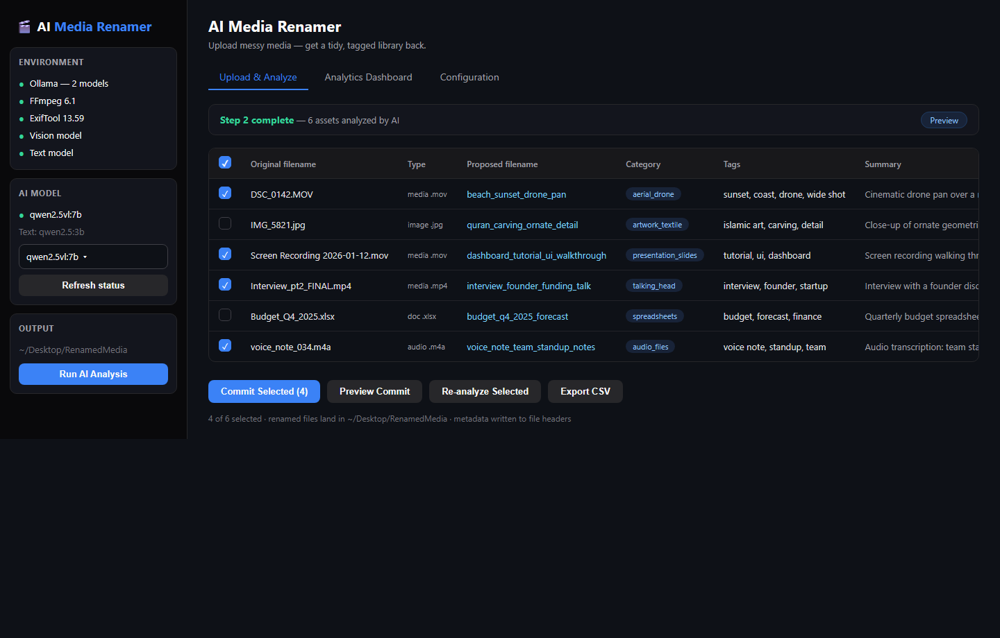
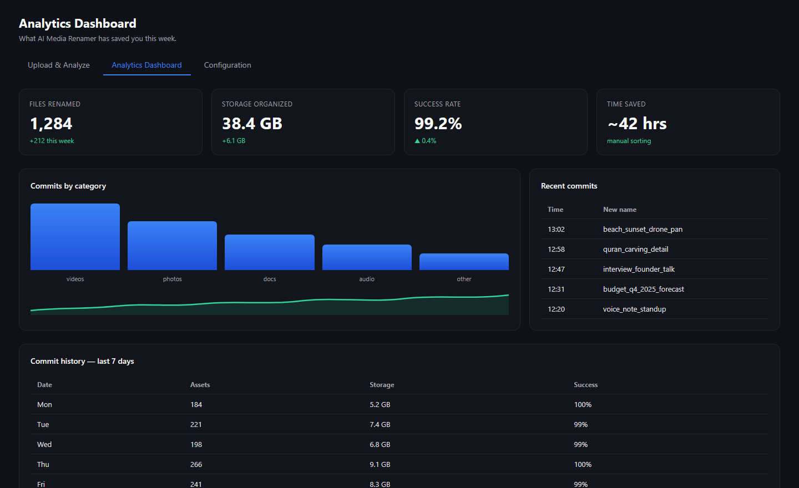
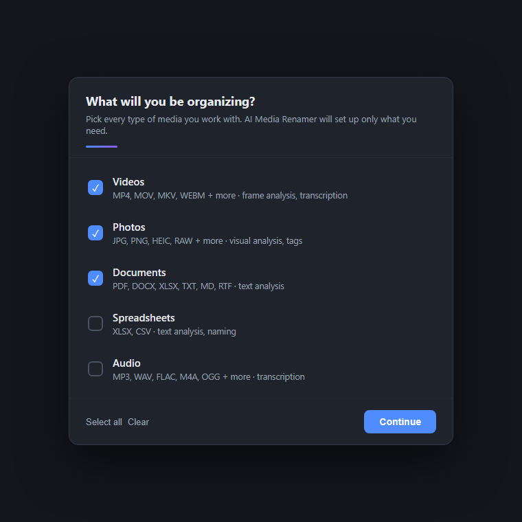

# Your media library, organized by AI. In minutes, not weekends.

**Stop hunting through "final_v3_ACTUAL.mp4".**

AI Media Renamer looks at every video, photo, document, and audio file you throw at it — understands what's actually inside — then renames, categories, and tags everything so your library finally makes sense. It runs **100% on your own machine**. No cloud, no uploads, no subscriptions.

---

## Why you'll love it

**You lose hours every week to a messy media library.** Downloads folder full of `IMG_5821.jpg` and `Recording_004.m4a`. A freelance folder where every edit is `final_final_v2_really.mp4`. Your DaVinci or Premiere timeline is chaos because nothing has a name you can find.

This is the tool that fixes it.

- **Drop in your mess → get back order.** One click starts the AI. It watches every frame, reads every document, transcribes every voice note, and figures out what each file is.
- **Names you'd actually search for.** `IMG_5821.jpg` becomes `quran_carving_ornate_detail.jpg`. `Recording_004.m4a` becomes `voice_note_team_standup_notes.m4a`.
- **Metadata written *into* the file — not a spreadsheet you'll ignore.** DaVinci Resolve, Premiere Pro, and Windows Explorer read it natively. Search "drone" and everything drone-related shows up.
- **Private by design.** Everything runs locally with Ollama. Your family videos and client work never leave your computer.
- **Safe.** Nothing is touched until you hit Commit, and one click on **Undo** reverses the whole batch.

---

## What it looks like

*AI reviews every file and proposes a filename, category, and searchable tags — all in one editable table.*

*A live dashboard shows what's been organized, how much storage is tidied, and a full commit history.*

*A first-run wizard asks what you organize (videos, photos, docs, audio…) and sets up exactly what you need.*

---

## What it handles

| | What the AI does for it |
|---|---|
| 🎬 **Videos** | Watches a frame, reads the audio track, names the shot (`beach_sunset_drone_pan`) |
| 📷 **Photos** | Understands the subject, adds tags Explorer can search |
| 📄 **Documents** | Reads PDF, DOCX, XLSX, TXT, MD, RTF and names them by content |
| 🎧 **Audio** | Transcribes voice notes locally, names them from what was said |
| ♻️ **Duplicates** | Spots near-identical photos, videos, and audio before they double your clutter |

---

## Getting started (60 seconds)

1. Download `AIMediaRenamer.exe` from the [Releases page](https://github.com/Abdulmusawwir/ai-media-renamer/releases/latest) — no installation, no accounts.
2. Double-click. It sets up its own AI engine on first launch (a guided wizard walks you through it).
3. Drop in your files → **Run AI Analysis** → review → **Commit**.

That's it. A folder that took an afternoon to organize by hand is done while you make tea.

> Prefer the command line or Docker? Want the full feature list, CLI flags, and system requirements? See [README_TECH.md](README_TECH.md).

---

## Who it's for

- **Content creators & editors** — whose drives are full of untitled exports.
- **Photographers** — drowning in `DSC_####` files that all look alike.
- **Freelancers & small studios** — needing client work organized and taggable.
- **Anyone with a chaotic downloads folder** — you know who you are.

---

## Roadmap — we're just getting started

- [ ] **Security hardening pass** — supply-chain audit, secrets handling, server exposure controls
- [ ] More AI models, cloud providers, and language support
- [ ] Auto-sorting into category folders
- [ ] Bulk import from cloud drives
- [ ] And whatever the community asks for next

---

## Support the project

If this saves you a weekend a month, consider supporting development — it funds new features, testing, and the coffee that powers them.

*Donation links coming soon.*

---

**Made with ❤️ from Tanzania by [Abdul Musawwir](https://github.com/Abdulmusawwir)**

Free forever · Open source · Runs on your machine, not ours

